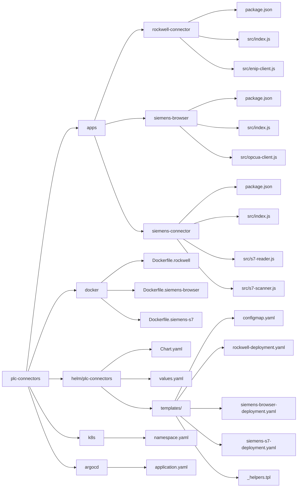

# CT PLC Connectors

A collection of modular, containerized PLC connectors designed for industrial environments with mixed automation technologies.  
This repository supports **Rockwell**, **Siemens S7 classic**, and **Siemens OPC UA** connectivity using **pure Node.js**, with a GitOps‑ready deployment model (Docker → Helm → Argo CD).

## 🔌 Overview

Many factories operate heterogeneous automation landscapes including:

- **Rockwell CompactLogix / ControlLogix (EtherNet/IP)**
- **Siemens S7‑200 / S7‑300 / S7‑400** (classic S7 protocol)
- **Siemens S7‑1200 / S7‑1500** (OPC UA available for symbolic access)

To support both **legacy** and **modern** PLCs uniformly, this repository provides three independent microservices:

| Connector | PLC Family | Protocol | Notes |
|----------|------------|----------|-------|
| **rockwell-connector** | Rockwell Control/CompactLogix | EtherNet/IP | Tag discovery + read/write using `st-ethernet-ip`. UDTs supported. |
| **siemens-connector** | S7‑200/300/400 + non‑optimized 1200/1500 | S7 (RFC1006) | Classic S7 access via `nodes7` + DB scanner for STRING/INT/REAL. |
| **siemens-browser** | S7‑1200/1500 | OPC UA | Symbolic browse + read/write using `node-opcua`. Requires OPC UA enabled on CPU. |

Each connector is deployed independently, has its own container, and can be enabled/disabled via Helm.

## 📁 Repository Layout



## 🚀 Build & Push (Docker → Artifact Registry)

### Build the three connectors

```bash
docker build -f docker/Dockerfile.rockwell \
  -t artifacts.ws.contitech.cloud/ctmanusdocker-it-ccoqi-smtfc-test-dev/rockwell-connector:0.1.0 .

docker build -f docker/Dockerfile.siemens-browser \
  -t artifacts.ws.contitech.cloud/ctmanusdocker-it-ccoqi-smtfc-test-dev/siemens-browser:0.1.0 .

docker build -f docker/Dockerfile.siemens-s7 \
  -t artifacts.ws.contitech.cloud/ctmanusdocker-it-ccoqi-smtfc-test-dev/siemens-s7:0.1.0 .

docker push artifacts.ws.contitech.cloud/ctmanusdocker-it-ccoqi-smtfc-test-dev/rockwell-connector:0.1.0
docker push artifacts.ws.contitech.cloud/ctmanusdocker-it-ccoqi-smtfc-test-dev/siemens-browser:0.1.0
docker push artifacts.ws.contitech.cloud/ctmanusdocker-it-ccoqi-smtfc-test-dev/siemens-s7:0.1.0
```

## Standard health commands

### HTTPS (recommended). Use -k only if you are using self-signed certs
```bash
curl -k https://ffk00084x.ct-ind.com/rockwell/healthz
curl -k https://ffk00084x.ct-ind.com/opcua/healthz
curl -k https://ffk00084x.ct-ind.com/s7/healthz
```
## Rockwell (EtherNet/IP)

### List tags (auto discovery):
```bash
curl -k "https://ffk00084x.ct-ind.com/rockwell/tags?ip=<PLC_IP>&slot=0"
```
### Read a tag:
```bash
curl -k "https://ffk00084x.ct-ind.com/rockwell/read?ip=<PLC_IP>&slot=0&tag=Program:MainRoutine.MyReal"
```
### Write a tag:
```bash
curl -k -X POST "https://ffk00084x.ct-ind.com/rockwell/write" \
  -H "Content-Type: application/json" \
  -d '{"ip":"<PLC_IP>","slot":0,"tag":"Program:MainRoutine.MyReal","value":123.45}'
```

## Siemens Browser (OPC UA — S7‑1200/1500)

### Browse (symbolic):
```bash
curl -k "https://ffk00084x.ct-ind.com/opcua/browse?endpoint=opc.tcp://<PLC_IP>:4840&nodeId=ObjectsFolder"
```
### Read by NodeId:
```bash
curl -k "https://ffk00084x.ct-ind.com/opcua/read?endpoint=opc.tcp://<PLC_IP>:4840&nodeId=ns=3;s=\"DB_1\".Temperature"
```

## Siemens S7 (classic RFC1006 — S7‑200/300/400 and non‑optimized 1200/1500)

### Read by absolute address:
```bash
curl -k -X POST "https://ffk00084x.ct-ind.com/s7/read" \
  -H "Content-Type: application/json" \
  -d '{"host":"<PLC_IP>","rack":0,"slot":2,"tags":{"temp":"DB1,REAL0","count":"DB1,INT4"}}'
```
### DB scanner (STRING / INT / REAL only):
```bash
curl -k -X POST "https://ffk00084x.ct-ind.com/s7/scan" \
  -H "Content-Type: application/json" \
  -d '{"host":"<PLC_IP>","db":40,"blockSize":256,"maxBytes":4096,"throttleMs":100}'
```
### Allow the bash use the scripts on ./scripts/*.sh:
```bash
chmod +x scripts/*.sh
```
### Starts with Selector on ./scripts/*.sh:
```bash
./scripts/scan-selector.sh
```
### To run the s7 scanner:
```bash
./scripts/scan-all.sh 192.168.0.10
```
### To run the s7 scanner with different ports and slots:
```bash
### ./scan-all.sh <PLC_IP> [start DB] [end DB] [rack] [slot]
### For S7-300
./scripts/scan-all.sh 192.168.0.10 1 300 0 2
### For S7-400
./scripts/scan-all.sh 192.168.0.20 1 500 0 3
### or
./scripts/scan-all.sh 192.168.0.20 1 500 0 4
### For S7-1200/1500 (classic)
./scripts/scan-all.sh 192.168.0.30 1 300 0 1
```

## Siemens Real Limits by CPUs
### S7-300
```bash
#Safe connection per second: 4-8 per second
#Notes: Over 10 per second may freeze comms task
```
### S7-400
```bash
#Safe connection per second: 8-12 per second
#Notes: More powerful
```
### S7-1200
```bash
#Safe connection per second: 2-6 per second
#Notes: Classic S7 slow via PUT/GET
```
### S7-1500
```bash
#Safe connection per second: 4-10 per second
#Notes: Prefer OPC UA
```
### Scanner Overload Risk Script to prevent failures:
```bash
# Overload classification (based on Siemens guidelines)
# < 8    req/sec → LOW (safe)
# 8–15   req/sec → MEDIUM (monitor)
# > 15   req/sec → HIGH (may overload PLC)
if (( $(echo "$REQ_PER_SEC < 8" | bc -l) )); then
    RISK="LOW"
elif (( $(echo "$REQ_PER_SEC < 15" | bc -l) )); then
    RISK="MEDIUM"
else
    RISK="HIGH"
fi
```